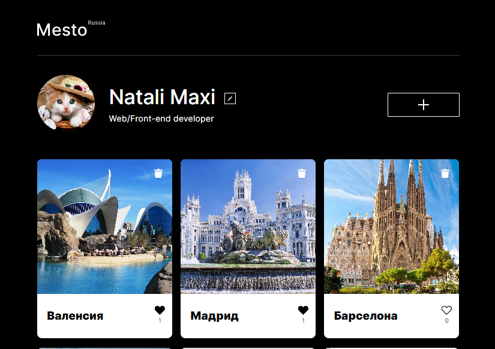

[](https://natalymaxi.github.io/mesto/)
# Проект: Место

## O проекте
Проект Mesto интерактивное приложение, позволяющее регистрироваться и авторизироваться пользователям,  редактировать свой профиль,  добавлять, удалять свои картинки, а так же лайкать понравившиеся картинки других пользователей.

### Функционал:
- Сайт адаптирован под разные устройства
- Манипуляции с классами CSS и с HTML при помощи JavaScript
### Стек технологий:
- HTML5;
  - Семантические теги
- CSS3:
  - Flexbox;
  - Grid Layout;
  - Media Queries;
  - Positioning of blocks and elements;
  - Adaptive UI;
  - Pseudo-classes
- JavaScript (ES 6):
  - ООП;
  - Формы находятся в модульном окне;
  - Валидация форм;
  - Асинхронный код: промисы и HTTP-запросы;
  - Транспиляция JS Babel;
  - API сервера Яндекс.Практикум
  - Webpack
- Методология БЭМ;
- Фйловая структура Nested БЭМ;
- Подключение шрифтов @font-face;

### Как установить и запустить проект:

* Клонировать репозиторий:

```console
    git clone https://github.com/NatalyMaxi/mesto.git
```

* Установить webpack:

```console
    npm i webpack --save-dev
```

* Установить зависимости:

```console
    npm install
```

* Собрать проект Вебпаком:

```console
    npm run build
```

* Запустить проект на локальном сервере:

```console
    npm run dev
```

[Ссылка на проект Github Pages](https://natalymaxi.github.io/mesto/)  
[Ссылка на этот проект на React с написанным back-end](https://github.com/NatalyMaxi/react-mesto-api-full)  
[Макет в Figma](https://www.figma.com/file/2cn9N9jSkmxD84oJik7xL7/JavaScript.-Sprint-4?node-id=0%3A1)  


